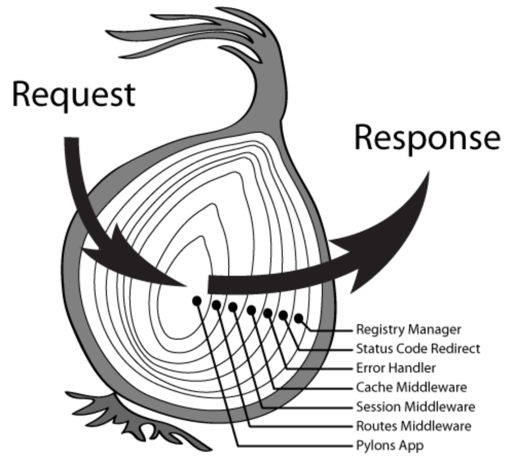

# 中间件介绍

## 中间件
中间件是一个函数，它处在HTTP Request和HTTP Response中间，用来实现某种中间功能，通过app.use()来加载中间件。

## app.use()中需要一个函数fn
app.use()调用个函数中间件 fn(context, next)，并传递了 context 和 next 函数两个参数。context 就是 koa 中的上下文对象 context。至于 next 函数可以简单的表示调用另外一个中间件。


## 中间件的执行顺序
多个中间件会形成栈结构，以先进后出的顺序执行：

最外层的中间件首先执行
代用next函数，把执行权交给下一个中间件
…
最内层的中间件最后执行
执行结束后，把执行权交回上一层的中间件
…
最外层的中间件收回执行权后，执行next函数后面的代码

这种先进后出的加载模型也可以叫做洋葱圈的模型：




## 例子


``` javascript
const Koa = require('koa');
const app = new Koa();
var sleep = require('sleep');

let port = 4000
// ctx.body 赋值时， 就返回给客户端
// response
app.use((ctx, next) => {
  console.log("test1")
  next()
  console.log("test1 end")
});

app.use((ctx, next) => {
  console.log("test2")
  next()
  console.log("test2 end")
});

app.use((ctx, next) => {
  console.log("test3")
  next()
  console.log("test3 end")
});
app.listen(port);
console.log('app started at port ' + port);

```

输出结果
``` bash
test1
test2
test3
test3 end
test2 end
test1 end

```


```
//对一个传统的程序员来说， 有点像简单的call

main{
  console.log("main begin")
  call f1
  console.log("main end")
}

f1{
  console.log("f1 begin")
  call f2
  console.log("f1 end")
}

f2{
  console.log("f2 begin")
  call f3
  console.log("f2 end")
}

f3{
  console.log("f3 begin")
  <!-- call f3 -->
  console.log("f3 end")
}
```