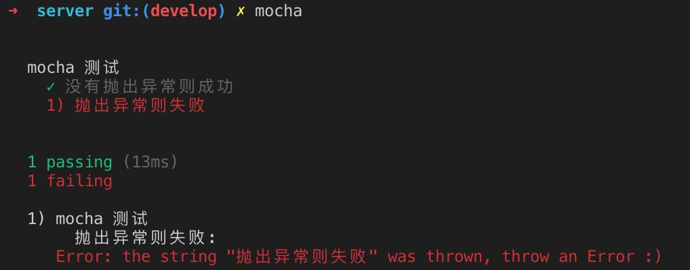

# 测试框架 Mocha 

## 一个简单的例子 Mocha

``` javascript
describe('mocha 测试', function() {
  
  it('没有抛出异常则成功', function() {
    let test =1
  });

  it('抛出异常则失败', function() {
    throw "抛出异常则失败"
  });

});
```

执行并返回结果


从结果可以看到， Mocha就是通过it块里面是否抛出异常`throw`来判断测试用例是不是通过

上面这段代码，就是测试脚本，它可以独立执行。测试脚本里面应该包括一个或多个`describe`块，每个`describe`块应该包括一个或多个`it`块。

`describe`块称为"测试套件"（test suite），表示一组相关的测试。它是一个函数，第一个参数是测试套件的名称（"加法函数的测试"），第二个参数是一个实际执行的函数。

`it`块称为"测试用例"（test case），表示一个单独的测试，是测试的最小单位。它也是一个函数，第一个参数是测试用例的名称（"1 加 1 应该等于 2"），第二个参数是一个实际执行的函数。


## 断言库的用法

从例子可以看到，  Mocha就是通过it块里面是否抛出异常`throw`来判断测试用例是不是通过， 而断言就可以实现抛出异常, 比起简单的抛出异常`throw`, 断言可以判断源码的实际执行结果与预期结果是否一致

所谓"断言"，就是判断源码的实际执行结果与预期结果是否一致，如果不一致就抛出一个错误。

所有的测试用例（it块）都应该含有一句或多句的断言。它是编写测试用例的关键。断言功能由断言库来实现，Mocha本身不带断言库，所以必须先引入断言库。

从官网可以看到， 断言库包括下面：
SERTIONS
Mocha allows you to use any assertion library you wish. In the above example, we're using Node.js' built-in assert module — but generally, if it throws an Error, it will work! This means you can use libraries such as:

[should.js](https://github.com/shouldjs/should.js) - BDD style shown throughout these docs
[expect.js](https://github.com/LearnBoost/expect.js) - expect() style assertions
[chai](https://www.chaijs.com/) - expect(), assert() and should-style assertions
[better-assert](https://github.com/visionmedia/better-assert) - C-style self-documenting assert()
[unexpected](https://unexpected.js.org/) - "the extensible BDD assertion toolkit"


基本上，expect断言的写法都是一样的。头部是expect方法，尾部是断言方法，比如equal、a/an、ok、match等。两者之间使用to或to.be连接。

## 自动重新加载当监控到测试的文件改变时
``` bash
mocha --watch-extensions js --watch
```

## 同步测试与异步测试

在第一个简单的例子中， 所有代码都是当前执行完毕， mocha 就会认为它跑完
``` javascript
describe('mocha 测试', function() {
  
  it('没有抛出异常则成功', function() {
    let test =1
  });

  it('抛出异常则失败', function() {
    throw "抛出异常则失败"
  });

});
```

## mysql 与 mocha

测试数据库访问时候， 发觉mocha后程序不会退出， 最后查到原来， 是连接池没有终结，这个时候mocha会等待！ 所以在mocha 的after 里面关闭连接池！
``` javascript 
after(() => {
  mysqlpool.end() // 注意的时要先获取mysqlpool
});
```

### mysql 与 mocha 参考链接
[mocha hangs after tests have finished](https://stackoverflow.com/questions/51046665/mocha-hangs-after-tests-have-finished)
[The difference between release and destroy for connection](https://github.com/mysqljs/mysql/issues/1486)


## 参考文档

[测试框架 Mocha 实例教程](http://www.ruanyifeng.com/blog/2015/12/a-mocha-tutorial-of-examples.html)

[mochajs官网](https://mochajs.org/)

[Node.js打造API-使用mocha來做單元測試](https://andy6804tw.github.io/2018/01/15/api-test/)
## 断言库的用法